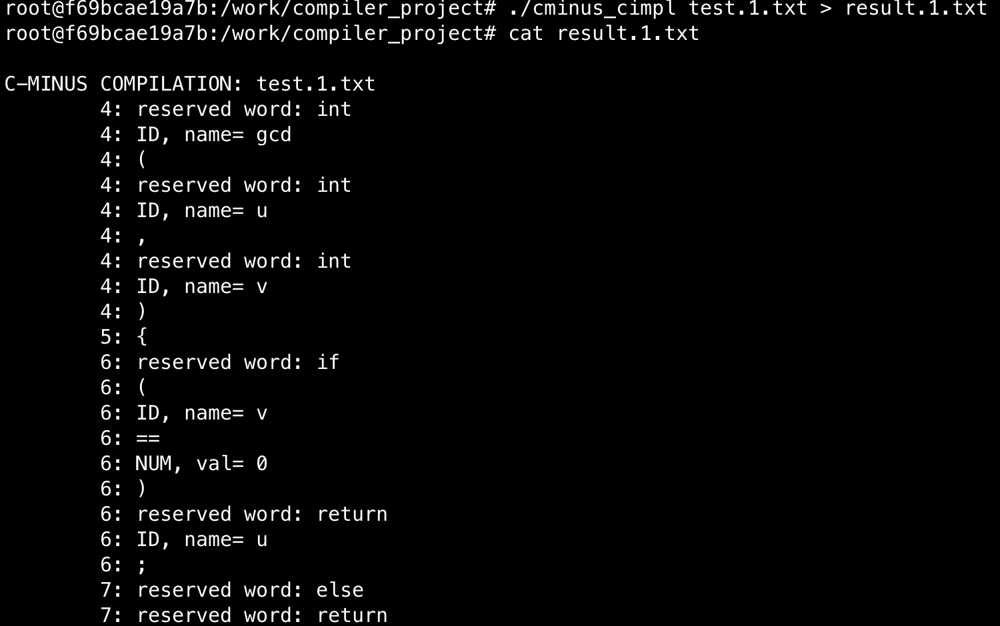
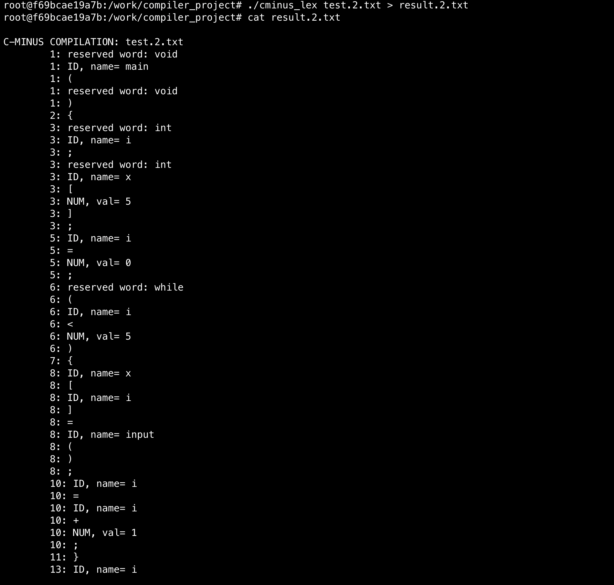

### Compiler Design Assignment1 - Lexical Analysis

**Student ID : 2020028377**
**Student Name : Mun GyeongTae**

<br>
<br>
<br>
<br>
<br>
<br>
<br>
<br>
<br>
<br>
<br>

과제 1 번의 경우 2가지 방법을 사용하여 Lexical Analysis를 수행하는 것입니다.
* **Method 1 : 직접 c코드를 이용하여 FSM 구현.**
* **Method 2 : flex를 이용하여 Lexical Analysis 구현**

아래에서 각 방법 별로 어떻게 구현했는지 설명드리도록 하겠습니다.

<br>
<br>
<br>
<br>
<br>
<br>
<br>
<br>
<br>
<br>
<br>
<br>
<br>

### Method 1. cminus - C implementation

첫 번째 방법의 경우 주어진 c 코드로 FSM을 구현하는 것입니다. 

구현 전, 과제의 명세에 따라 몇 가지 파일을 수정하도록 하겠습니다. 바꿀 파일들은 각각 **globals.h**, **main.c**, **scan.c**, **util.c** 네 개 입니다. 각각의 파일들은 명세에 따라 고치면 됩니다.

명세에 따라 파일을 고치고 난 후, scan.c를 FSM에 맞게 고쳐주시면 됩니다. 여기서 중요한 건, **STATE**와 **SYMBOL**을 잘 보고 이에 맞게 구현하는게 중요합니다. 대부분의 심볼과 state의 경우 만들어져 있는 스켈레톤 코드를 따라가면 됩니다.

먼저 single token으로 알 수 있는 SYMBOL들이 있습니다. 그 다음 ==, !=, >=, <=과 같이 두 개의 토큰이 있어야 결정할 수 있는 SYMBOL들이 있습니다.

두 개의 토큰으로 결정되는 SYMBOL의 경우엔 STATE를 활용하여 구현할 계획입니다. 과제에서 명시한 12개의 STATE와 더불어, comment를 위한 한 개의 state를 추가로 사용할 계획입니다. (이유는 후술합니다.)

먼저 scan.c 파일을 뜯어봅시다. scan.c 파일을 뜯어보면 getToken이라는 함수 안에 다음과 같은 내용이 있습니다. 이때 state에따라 save, currentToken, state를 바꾸는 것을 알 수 있습니다. 또, unGetNextchar()함수도 있는데, 이는 다음 charcter를 받지않고 다시 백업으로 돌아가는 역할을 해줍니다.

먼저 STATE가 DONE 상태에 들어왔으면 single symbol로 결정할 수 있는 모든 심볼들에 대해서 다 결정해줍니다. 다음으로 STATE가 DONE이 아닌 경우, single symbol로 결정할 수 없는 경우 state를 나눠서 각 경우에 맞춰서 나눠줍니다. 이때 symbol이 된다면 save하고, 그렇지 않으면 save를 false로 둡니다.
```c
  ...
  case INNE:
    state = DONE;
    if (c == '=')
      currentToken = NE;
    else {
      /* backup in the input */
      ungetNextChar();
      save = FALSE;
      currentToken = ERROR;
    }
    break;
  ...
```
마지막으로 코멘트의 경우 2가지가 아닌 3가지 경우로 나누어서 생각합니다. **INCOMMENT_** → 코멘트가 막 시작했을 때, **INCOMMENT** → 주석 안, **_INCOMMENT** → '*'이 들어왔을 때로 생각합니다. 그렇게 해야 끝나는 부분에서 */ 을 SYMBOL로 받기 편합니다. 그렇게 3개를 결정하고 나면 처음에 **/** 이 들어왔을 때 INOVER state에서 INCOMMENT_ 로 갈지, OVER로 갈지 결정할 수 있습니다. 이렇게 구현하면 Cminus_cimpl을 구현할 수 있습니다.

```c
  case INCOMMENT_:
    ...
    else if (c == '*') 
      state = _INCOMMENT;
    break;
  case INCOMMENT:
    ...
    else if (c == '*') 
      state = _INCOMMENT;
    break;
  case _INCOMMENT:
    ...
    /* end of comment */
    else if (c == '/') 
      state = START;
    /* stay in comment state */
    else if (c != '*')
      state = INCOMMENT;
    break;
```

결과는 다음과 같이 나옵니다.


### Method 2. cminus lex
이번엔 lex파일을 이용하여 구현해봅시다. l파일은 lex폴더 안에 위치해있고, 선언 부분, 규칙 부분, 서브루틴 부분이 있는데, 규칙부분만 조금 수정하면 바로 결과를 확인할 수 있습니다.
규칙부분에서 아까 명세에서 언급했던 symbol들을 추가해주고 수정해주면 됩니다

```lex
"if"            {return IF;}
"else"          {return ELSE;}
"while"         {return WHILE;}
...
"}"             {return RCURLY;}
";"             {return SEMI;}
...
```

그리고 마지막으로 처음에 있던 "{" → 이 규칙부분을 **"/*"** 로 바꿔준 뒤, 주석 규칙을 추가해줍니다. 규칙은 다음과 같이 짜면 됩니다. 
1. "/*"이 들어왔을 때
2. EOF가 되면 멈춘다.
3. "*"이 들어올 때까지 계속 input을 받는다.
4. 만약 "*" 다음에 "/"이 들어오면 멈춘다. 아니면 다시 input을 받는다.

이것에 맞게 구현하면 다음과 같습니다.
```lex
"/*"            { 
                  char c;
                  while(1) {
                    c = input();
                    if (c == 0) break;
                    if (c == '\n') lineno++;

                    if (c == '*') {
                      c = input();
                      if (c == 0) break;
                      else if (c == '/') break;
                    }
                  }
                }
```

결과는 다음과 같습니다.



