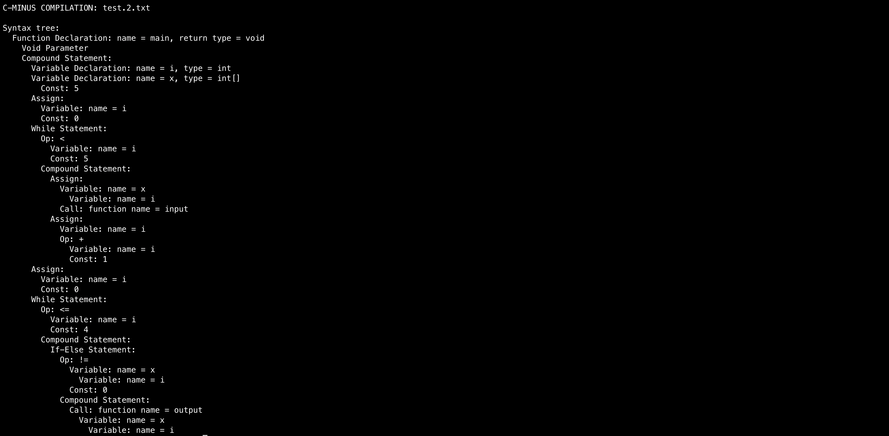

### Compiler Design Assignment2 - Syntax Analysis

**Student ID : 2020028377**
**Student Name : Mun GyeongTae**

과제 2번의 경우 Syntax Analysis를 bison을 이용하여 구현하는 것입니다.
* **Method 1 : cminus.y, util.c, globals.h를 이용하여 syntax output 구현**

### cminus.y, util.c globals.h -> syntax analyzer 구현
먼저 Kind를 크게 4가지로 분류해줍니다. 그리고 ExpType을 두 개로 분류해줍니다.
```c
    typedef enum {StmtK,ExpK,DeclK,ParamK,TypeK} NodeKind;
    typedef enum {CompK,IfK,IterK,RetK} StmtKind;
    typedef enum {AssignK,OpK,ConstK,IdK,ArrIdK,CallK} ExpKind;
    typedef enum {FuncK,VarK,ArrVarK} DeclKind;
    typedef enum {ArrParamK,NonArrParamK} ParamKind;
```

다음과 같이 분류가 끝났으면 분류한 정보에 따라 treeNode의 기본적인 골자를 짜줍니다.

```c
typedef struct treeNode
   { ...
        union { StmtKind stmt;
             ExpKind exp;
             DeclKind decl;
             ParamKind param;
            } kind;
     union { TokenType op;
             TokenType type;
             int val;
             char * name;
             ArrayAttr arr;
             struct ScopeRec * scope; } attr;
     ExpType type; /* for type checking of exps */
   } TreeNode;
```

globals.h 파일 작성이 끝났으면 이 파일에 따라 이제 cminus.y, util.c, util.h를 바꿔줍시다. 먼저 cminus.y 파일부터 보겠습니다. cminus.y 파일은 기본적인 tiny.y를 제공해주지만, 나머지 타입은 다 스스로 구현해야합니다.

먼저 저희가 예전에 짰던 lex file에서 썼던 토큰과 심볼을 가져와 줍니다. 그리고 타입을 저장해줄 전역변수들도 같이 선언해줍니다.

그리고 룰 섹션에서 각각의 역할에 맞게 룰을 정의하고 구현합니다. 다음과 같이 정의하고 구현할 수 있습니다.
| **분류**                  | **비단말 기호(Nonterminal)** | **주요 역할**      | **핵심 설명 / 특징**                                         |
| ----------------------- | ----------------------- | -------------- | ------------------------------------------------------ |
| **타입 및 식별자 처리**     | `type_spec`             | 자료형 지정         | `int`, `void` 키워드 처리 후 `savedType`에 저장                 |
|                         | `saveName`              | 식별자 이름 저장      | `ID`를 받아 `newExpNode(IdK)` 생성 및 이름 복사                  |
|                         | `saveNumber`            | 숫자 상수 저장       | `NUM`을 받아 `ConstK` 노드 생성                               |
| **변수 선언**           | `var_decl`              | 변수 선언 구문       | - 일반 변수: `int x;`<br> - 배열 변수: `int x[10];`            |
| **함수 선언**           | `fun_decl`              | 함수 정의 구문       | `type_spec ID ( params ) { ... }` 구조 처리, `FuncK` 노드 생성 |
|                         | `params`                | 함수 매개변수 전체     | `param_list` 또는 `void` 형태 허용                           |
|                         | `param_list`            | 매개변수 목록        | 여러 매개변수를 콤마로 구분하여 연결                                   |
|                         | `param`                 | 개별 매개변수        | 일반 변수 매개변수(`int a`)와 배열 매개변수(`int a[]`) 구분             |
| **블록 구조**           | `comp_stmt`             | 복합문 (중괄호 `{}`) | 지역 변수 선언(`local_decls`)과 문장 리스트(`stmt_list`)를 포함       |
|                         | `local_decls`           | 지역 변수 선언       | 블록 내 변수 선언들을 연결                                        |
|                         | `stmt_list`             | 문장 리스트         | 복수의 문장을 순서대로 연결                                        |
| **문장(Statements)**  | `stmt`                  | 문장 단위          | 표현식문, 조건문, 반복문, 반환문, 블록문 등으로 분기                        |
| **표현식(Expression)** | `exp`                   | 전체 표현식         | `var = exp` (대입문) 또는 `simple_exp` (일반 표현식)             |
| **변수 / 배열 참조**      | `var`                   | 변수 참조 구문       | 단일 변수(`x`) 또는 배열 참조(`x[i]`) 처리                         |
| **함수 호출**           | `call`                  | 함수 호출식         | `ID ( args )` 형태, `CallK` 노드 생성                        |
|                         | `args`                  | 인자 목록 전체       | 비어 있을 수도 있음                                            |
|                         | `arg_list`              | 인자 리스트         | 콤마로 구분된 표현식들의 연결                                       |

이렇게 규칙을 정하고 cminus.y를 구현하였다면, 이번에는 util.c를 구현해봅시다. 각 노드마다의 새로운 구조체를 선언하고, 이를 활용하여 print하는 것이 목적입니다. printtree의 경우 기존에 있던 Kind를 활용하여 분기처리만 하면 되므로 각 노드의 구조체부터 봅시다. ExpNode와, StmtNode의 경우 이미 구현되어 있었으므로 새롭게 Kind로 추가된 Decl과, Param의 노드만 추가해줍시다.

```c
/* Function newParamNode creates a new declation
* node for syntax tree construction
*/
TreeNode * newDeclNode(DeclKind kind)
{ 
        TreeNode * t = (TreeNode *) malloc(sizeof(TreeNode));
        int i;
        if (t==NULL)
        fprintf(listing,"Out of memory error at line %d\n",lineno);
        else {
                for (i=0;i<MAXCHILDREN;i++) t->child[i] = NULL;
                t->sibling = NULL;
                t->nodekind = DeclK;
                t->kind.decl = kind;
                t->lineno = lineno;
        }
        return t;
}

/* Function newParamNode creates a new parameter
* node for syntax tree construction
*/
TreeNode * newParamNode(ParamKind kind)
{ 
        TreeNode * t = (TreeNode *) malloc(sizeof(TreeNode));
        int i;
        if (t==NULL)
                fprintf(listing,"Out of memory error at line %d\n",lineno);
        else {
                for (i=0;i<MAXCHILDREN;i++) t->child[i] = NULL;
                t->sibling = NULL;
                t->nodekind = ParamK;
                t->kind.param = kind;
                t->lineno = lineno;
        }
        return t;
}
```

그래서 테스트는 결과는 다음과 같았습니다.
